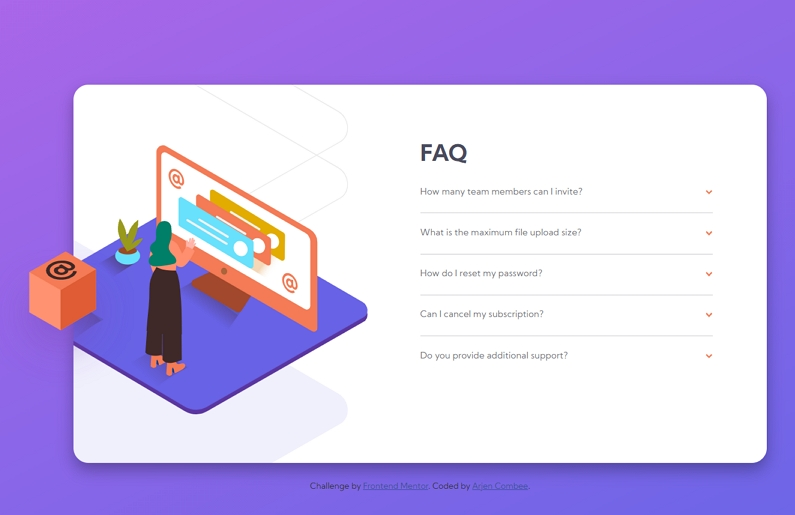

# Frontend Mentor - FAQ accordion card solution

This is a solution to the [FAQ accordion card challenge on Frontend Mentor](https://www.frontendmentor.io/challenges/faq-accordion-card-XlyjD0Oam). Frontend Mentor challenges help you improve your coding skills by building realistic projects.

## Table of contents

- [Frontend Mentor - FAQ accordion card solution](#frontend-mentor---faq-accordion-card-solution)
  - [Table of contents](#table-of-contents)
  - [Overview](#overview)
    - [The challenge](#the-challenge)
    - [Screenshot](#screenshot)
    - [Links](#links)
  - [My process](#my-process)
    - [Built with](#built-with)
    - [What I learned](#what-i-learned)
    - [Continued development](#continued-development)
  - [Author](#author)
  - [Acknowledgments](#acknowledgments)

## Overview

### The challenge

Users should be able to:

- View the optimal layout for the component depending on their device's screen size
- See hover states for all interactive elements on the page
- Hide/Show the answer to a question when the question is clicked

### Screenshot



### Links

- Solution URL: [Add solution URL here](https://your-solution-url.com)
- Live Site URL: [Add live site URL here](https://arjencombee.github.io/002_faq/)

## My process

### Built with

- Semantic HTML5 markup
- CSS custom properties
- Flexbox
- CSS Grid
- Mobile-first workflow

### What I learned

I learned how to work with CSS animations. Also learend how to hide and show content with only CSS.

Working with images is stil a struggle, but I'm learning 😀.

To see how you can add code snippets, see below:

_Loading images based on screen size_

```html
<picture class="accordion__image--main">
  <source
    media="(min-width: 800px)"
    srcset="images/illustration-woman-online-desktop.svg"
  />
  
</picture>
```

_Here the show and hide with CSS magic happens_

```css
.accordion__input:checked ~ .accordion__label::after {
  transform: translateY(-50%) rotate(0.5turn);
}
```

### Continued development

Need to learn more about responsive images and how to place them on the pages. Mobile and Desktop with a minimum of CSS declarations.

## Author

- Website - [Arjen Combee](https://arjencombee.nl)
- Frontend Mentor - [@ArjenCombee](https://www.frontendmentor.io/profile/ArjenCombee)

## Acknowledgments

I want to say a big thank you to people who are responible for my **junior junior skills** in webdevelopment:

- Brad Traversy - [Traversy Media](https://www.traversymedia.com/)
- Jonas Schmedtmann - [Codingheroes](https://codingheroes.io/)
- Kevin Powell - [Kevin Powell on youtube](https://www.youtube.com/kevinpowell)

♥ Thanks
